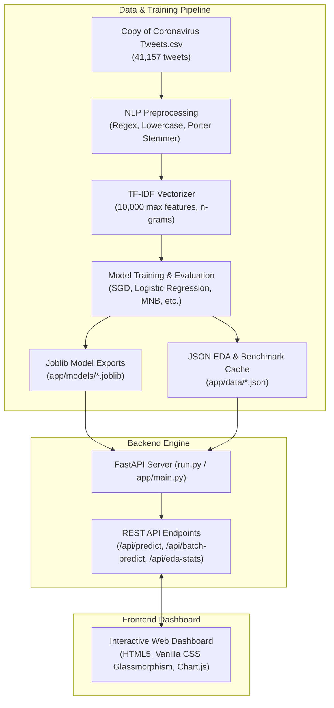

# COVID-19 Sentiment AI & Prediction Dashboard

[](https://www.python.org/)
[](https://fastapi.tiangolo.com/)
[](https://scikit-learn.org/)
[](LICENSE)
[](https://github.com/Logic-ui)

An end-to-end Machine Learning web application and analytics platform for analyzing Coronavirus pandemic tweets. Featuring high-precision sentiment classifiers (**SGD**, **Logistic Regression**, **Multinomial Naive Bayes**), full **Exploratory Data Analysis (EDA)** across 41,000+ tweets, and a modern **Glassmorphic Dark Mode Dashboard** with interactive **Chart.js** visualizations.

---

## 📑 Table of Contents
- [Architecture Overview](#-architecture-overview)
- [Key Features](#-key-features)
  - [1. Real-Time Sentiment Predictor](#1--live-real-time-sentiment-predictor)
  - [2. Exploratory Data Analysis (EDA)](#2--exploratory-data-analysis-eda-graphs)
  - [3. Model Leaderboard & Evaluation](#3--model-benchmark-leaderboard--confusion-matrix)
  - [4. Lexical & Hashtag Intelligence](#4--hashtag--vocabulary-intelligence)
  - [5. Batch Tweet Analyzer](#5--batch-tweet-analyzer)
- [Benchmark Results](#-model-benchmark-summary)
- [Project Directory Structure](#-project-structure)
- [Quickstart Guide](#-quickstart-guide)
- [API Documentation](#-api-endpoints-reference)
- [Testing](#-running-tests)
- [License & Author](#-author--license)

---

## 🏗️ Architecture Overview



---

## 🌟 Key Features

### 1. ⚡ Live Real-Time Sentiment Predictor & Multi-Model Arena
- **Multi-Model Inference Engine**:
  - **Stochastic Gradient Descent (SGD Classifier)**: Top performer (**85.96%** accuracy)
  - **Logistic Regression**: High precision linear model (**85.48%** accuracy)
  - **Multinomial Naive Bayes**: Fast probabilistic baseline (**78.79%** accuracy)
- **⚔️ Multi-Model Battle Arena Mode**:
  - Execute inference across all 3 classifiers in parallel on a single tweet.
  - **Consensus Engine**: Calculates unanimous (3/3), majority (2/3), or split verdicts.
  - Real-time latency tracking (in milliseconds) and side-by-side probability mini-meters.
- **🎯 Dynamic SVG Circular Gauge**:
  - Replaces static badges with a smooth, glowing SVG circular confidence meter that sweeps and adapts its glowing hue (Emerald, Cyan, Rose) based on sentiment.
- **🔬 Text X-Ray (Inline Sentiment Attribution)**:
  - Highlights positive words in glowing emerald, negative terms in rose, and neutral words in cyan.
  - Interactive hover tooltips displaying each keyword's TF-IDF impact polarity score.
- **🕸️ Pandemic Emotion Nuance Radar Chart**:
  - Chart.js 5-dimensional emotional nuance radar (*Optimism & Gratitude*, *Panic & Urgency*, *Frustration & Grievance*, *Public Health & Safety*, *Factual / Informative*).
- **🎲 Surprise Me (Live Stream Simulator)**:
  - Generates authentic pandemic tweets with an animated typewriter effect and instant classification.
- **Dual Classification Modes**:
  - **3-Class Mode**: Positive, Neutral, Negative with calibrated probabilities.
  - **Binary Mode**: Positive/Neutral vs Negative (primary benchmark from exploratory notebook).

### 2. 📊 Exploratory Data Analysis (EDA) Graphs
- **Dataset Scale**: Evaluated on **41,157 tweets** across **12,220 unique worldwide locations** between March 16 and April 14, 2020.
- **Animated CountUp KPIs**: Smooth number roll-up animations on dashboard load.
- **Interactive Visualizations**:
  - **Sentiment Distribution (Donut Chart)**: Toggle between 5-Class, 3-Class, and Binary distributions.
  - **Timeline Trend (Area Chart)**: Chronological daily tweet volume over March–April 2020 (`TweetAt` timeline).
  - **Top 15 Tweet Locations**: Geographic breakdown (London, New York, Toronto, California, etc.).
  - **Data Integrity Profile**: Attribute completeness audit for all 6 columns (`df.isnull()`).

### 3. 🏆 Model Benchmark Leaderboard & Confusion Matrix
- Direct benchmark of all 7 algorithms evaluated in the notebook:
  1. **Stochastic Gradient Descent (SGD)** — **85.96%** (Winner 🏆)
  2. **Logistic Regression** — **85.48%**
  3. **CatBoost Classifier** — **84.35%**
  4. **Support Vector Machines (SVC)** — **83.67%**
  5. **Random Forest Classifier** — **82.12%**
  6. **XGBoost Classifier** — **81.46%**
  7. **Multinomial Naive Bayes** — **78.79%**
- **Interactive Metric Filters**: Rank models by Accuracy, Precision, Recall, or F1-Score.
- **2x2 Confusion Matrix Heatmap**: Visual breakdown of True Negatives, False Positives (Type I), False Negatives (Type II), and True Positives.
- **Model Accuracy Comparison Bar Plot**: Reproducing notebook benchmarking visualizations.

### 4. 🔬 Hashtag & Vocabulary Intelligence
- **Filterable Hashtags**: Inspect top hashtags by sentiment category (`#coronavirus`, `#stayhome`, `#panicbuying`, `#toiletpaper`, `#grocery`).
- **Lexical Term Cloud**: Prominent terms sized and color-coded proportionally to frequency.

### 5. 📁 Batch Tweet Analyzer with Drag & Drop & Live Search
- **Drag & Drop File Dropzone**: Accepts `.csv` (auto-extracts tweet text column) and `.txt` files (one per line).
- **Live Search & Sentiment Filters**: Instant search box and filter pills (All, Positive, Neutral, Negative) with counter badges.
- **One-Click Export & Copy**: Copy batch summary text or download timestamped CSV.

### 6. 🔊 Web Audio Synthesizer (Sci-Fi Sound FX)
- Pure Web Audio API sound generator (no external audio files).
- Produces futuristic UI feedback on button clicks and prediction completions.
- Header toggle button (SFX: ON / OFF) with user preference stored in `localStorage`.

---

## 📊 Model Benchmark Summary

| Model | Accuracy | Precision | Recall | F1-Score | Status |
|---|---|---|---|---|---|
| **Stochastic Gradient Descent (SGD)** | **85.96%** | **86.10%** | **85.96%** | **85.91%** | 🏆 Best Overall |
| **Logistic Regression** | **85.48%** | **85.55%** | **85.48%** | **85.44%** | 🥈 Runner-Up |
| **CatBoost Classifier** | **84.35%** | **84.42%** | **84.35%** | **84.30%** | Solid Gradient Boost |
| **Support Vector Classifier (SVC)** | **83.67%** | **83.75%** | **83.67%** | **83.62%** | High Margin Separator |
| **Random Forest Classifier** | **82.12%** | **82.20%** | **82.12%** | **82.08%** | Ensemble Bagging |
| **XGBoost Classifier** | **81.46%** | **81.52%** | **81.46%** | **81.40%** | Fast Tree Boosting |
| **Multinomial Naive Bayes** | **78.79%** | **78.90%** | **78.79%** | **78.70%** | Probabilistic Baseline |

---

## 🛠️ Project Structure

```
sentimental_analysis/
├── Copy of Coronavirus Tweets.csv   # Raw dataset (41,157 tweets)
├── sentimental_analysis.ipynb       # Original Jupyter Notebook exploration & training
├── train_and_export.py              # Automated model training and EDA export script
├── test_api.py                      # Automated test suite for all endpoints
├── run.py                           # Single-command launcher (auto-checks models)
├── requirements.txt                 # Python dependencies
├── .gitignore                       # Standard Python / IDE git exclusions
└── app/
    ├── main.py                      # FastAPI backend application & API routing
    ├── data/                        # Pre-calculated EDA stats and sample records
    │   ├── eda_stats.json
    │   ├── model_benchmark.json
    │   └── sample_tweets.json
    ├── models/                      # Serialized Scikit-Learn models and vectorizer
    │   ├── vectorizer.joblib
    │   ├── sgd_binary.joblib
    │   ├── lr_binary.joblib
    │   ├── nb_binary.joblib
    │   ├── sgd_tri.joblib
    │   ├── lr_tri.joblib
    │   └── nb_tri.joblib
    └── static/                      # Modern dashboard user interface
        ├── index.html               # Semantic HTML5 layout
        ├── css/
        │   └── style.css            # Vanilla CSS design system (Dark mode & glassmorphism)
        └── js/
            └── app.js               # Client interaction & Chart.js logic
```

---

## 🚀 Quickstart Guide

### 1. Clone the Repository
```bash
git clone https://github.com/Logic-ui/sentimental_analysis.git
cd sentimental_analysis
```

### 2. Create and Activate a Virtual Environment
```bash
# Windows
python -m venv venv
venv\Scripts\activate

# macOS / Linux
python3 -m venv venv
source venv/bin/activate
```

### 3. Install Dependencies
```bash
pip install -r requirements.txt
```

### 4. Launch the Dashboard
```bash
python run.py
```

The launcher will verify that trained models exist (or train them automatically if needed) and start the local server:
- **Interactive Dashboard**: [http://127.0.0.1:8000](http://127.0.0.1:8000)
- **Interactive Swagger Docs**: [http://127.0.0.1:8000/docs](http://127.0.0.1:8000/docs)
- **Redoc Documentation**: [http://127.0.0.1:8000/redoc](http://127.0.0.1:8000/redoc)

---

## 📡 API Endpoints Reference

| Method | Endpoint | Description | Payload Example |
|---|---|---|---|
| `POST` | `/api/predict` | Real-time sentiment prediction, confidence, sentiment drivers, and NLP pipeline breakdown | `{"text": "Vaccine distribution is speeding up!", "model_type": "sgd", "mode": "three_class"}` |
| `POST` | `/api/predict-arena` | Multi-model parallel battle arena across SGD, Logistic Regression, and Naive Bayes with consensus rating | `{"text": "Vaccine distribution is speeding up!", "mode": "three_class"}` |
| `POST` | `/api/batch-predict` | Bulk analysis for multiple tweets with distribution metrics | `{"texts": ["Text 1", "Text 2"]}` |
| `GET` | `/api/eda-stats` | Full dataset statistics, timelines, and top locations | — |
| `GET` | `/api/model-benchmark` | 7-model leaderboard, metrics, and confusion matrix | — |
| `GET` | `/api/samples` | Curated sample tweets for one-click testing | — |

---

## 🧪 Running Tests

Ensure backend health and accuracy by executing the automated test script:
```bash
python test_api.py
```

---

## 👤 Author & License

Developed by **[Logic-ui](https://github.com/Logic-ui)**.

This project is licensed under the **MIT License** - feel free to use and adapt it for academic, personal, or commercial projects.

